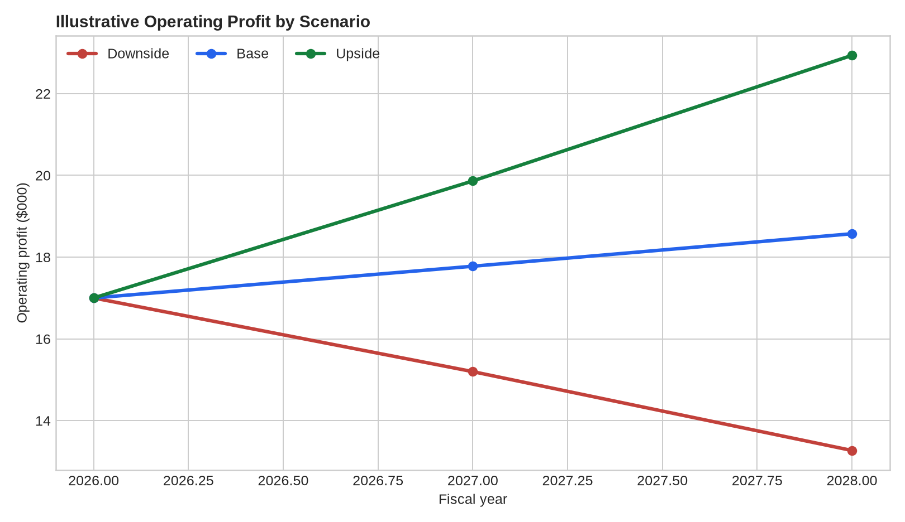
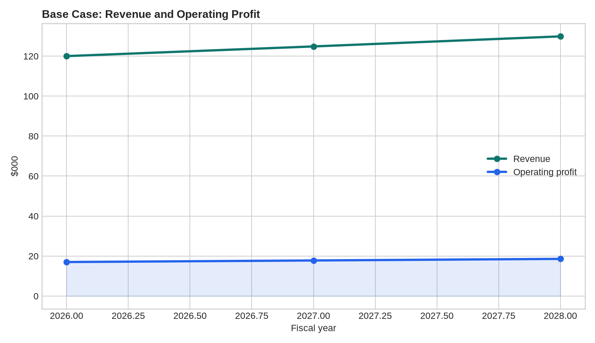
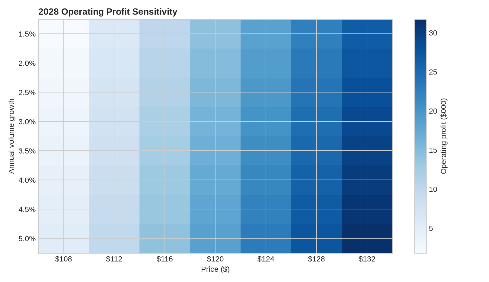

# Financial Modelling Starter System

> Reusable FP&A-style financial model covering assumptions, forecasting, scenarios, sensitivities, and model QA.

## Business Problem

Decision-makers need a model that links assumptions to revenue, costs, cash generation, and downside/upside outcomes without becoming a black box.

## Analytical Questions

- Where is the forecast most sensitive to operating assumptions?
- What drives the largest profit and cash changes?
- What happens under base, upside, and downside scenarios?
- Which model controls should be checked before decision use?

## Deliverables

- Assumptions input layer
- Revenue and cost forecast
- Three-statement-style model structure
- Scenario manager
- Sensitivity tables
- Model QA checklist
- Executive summary

## Suggested Repository Structure

```text
financial-modelling-starter-system/
├── data/
├── notebooks/
├── src/
├── tests/
├── outputs/
├── README.md
└── requirements.txt
```

## Stack

Python, pandas, NumPy, Excel-compatible outputs, Plotly

## Method

1. Define the decision context and metric definitions.
2. Profile and validate the data.
3. Build reproducible transformations and calculations.
4. Quantify the main drivers, scenarios, or failure modes.
5. Validate outputs and document limitations.
6. Produce an executive-ready decision narrative.

## Portfolio Standard

Use synthetic or public data with documented provenance. Clearly distinguish measured results from assumptions and illustrative scenarios.

## Sample Outputs

The repository includes a reproducible illustrative scenario model generated by `python src/generate_outputs.py`. The inputs are synthetic assumptions for a fictional business and are labelled as such; they are not market or company forecasts.

### Executive summary

See [`outputs/executive_summary.md`](outputs/executive_summary.md) for the decision readout, controls, and limitations.

### Visual outputs







### Reproducible files

- [`data/assumptions.csv`](data/assumptions.csv) — scenario inputs
- [`outputs/annual_forecast.csv`](outputs/annual_forecast.csv) — three-year forecast
- [`outputs/scenario_summary.csv`](outputs/scenario_summary.csv) — 2028 scenario comparison
- [`outputs/sensitivity_profit.csv`](outputs/sensitivity_profit.csv) — price/volume sensitivity grid
